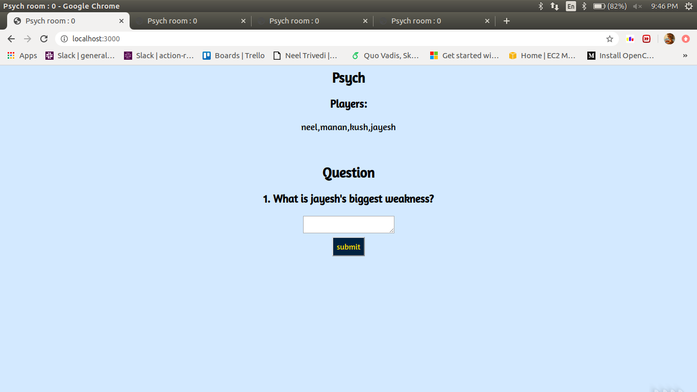

# Psych Game Server

I have tried implementing the famous multiplayer fun game 'psych' using websockets and node Server

## Screenshots

You can either create a new game room or join an existing one created by your friends.


Multiple friends can join the existing room to have great game play experience


Answer interesting and funny questions.


Select the answer you like the most


See the score board after each question


## How to run the code

Clone this repo and execute the following commands,

```
>npm install #to install dependencies
>npm start #to start the server
```

Once server is started go to ```http://localhost:3000``` on your browser and start enjoying

## Steps to play game

1. Run the above commands and go to ```http://localhost:3000```

2. Enter your name and create a new room or join an exisiting one

3. If you create a new room, you can see the room number in the title of your browser, share this room number with your friends and ask them to join.

4. Once all players have joined, the player who created the room can start the game.

#### ToDo List:

- Allow players to leave or join a room once a game has already started

- Handle refresh actions by users
